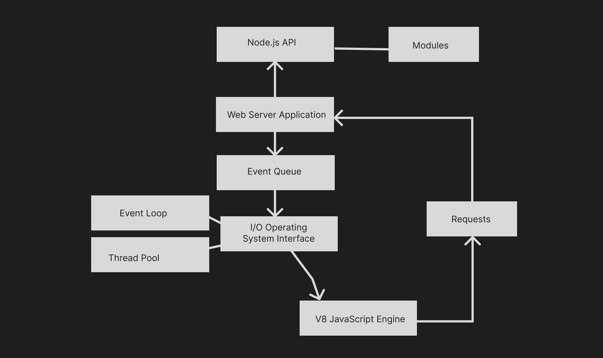

# INFO 443 Project 2 - Nodejs

Collaborators: Leah Jia, Hamda Hassan, Yuhang Liu, Efra Ahsan

## Content and Background
**Forked repo: https://github.com/efra-tech/node**   

Node.js is a popular open-source JavaScript runtime environment that can run on various platforms such as Windows, MacOSX, Linux, and more–and it’s free. It essentially enables developers to run JavaScript code on the server-side, rather than through just the web browser. Node can communicate with the computer’s server and file system in a memory-efficient, asynchronous, and single-threaded manner, which was more difficult and slow before its invention. It’s commonly used by developers to create a database within a computer’s server, and modify or use the data in a streamlined way, which therefore helps make webpage content more dynamic and pertaining to the real-time data. It provides an event-driven, non-blocking I/O model that is well-suited for building real-time and scalable network applications. Node.js is a powerful development tool for building backended web applications and has gained widespread adoption among developers.  

Node.js was written initially by Ryan Dahl, a software engineer, in 2009. He released the first version of Node.js in 2010, which initially supported only Linux and Mac OS X. Also in 2010, the Node.js environment adopted its package manager, npm, which is still in place today. The package manager streamlines the software installations and updates, as well as facilitates the ability to share and publish source code. By 2015, Node.js was governed by the Node.js Foundation, which is a collaborative project of the Linux Foundation. It has now merged with the JS Foundation to form the [OpenJS Foundation](https://openjsf.org/).   

The Node.js project has a technical steering committee (TSC) that is responsible for approving high-level changes to the codebase and architecture. The TSC is made up of a group of individuals who have made significant contributions to the project and who are elected by the community. They are responsible for voting to set the technical direction of the project and reviewing and approving changes to the codebase. In addition to the TSC, there is also a core team of maintainers who are responsible for reviewing and merging pull requests, managing issues, and ensuring the overall health of the project.   

To view the project on GitHub, navigate [here](https://github.com/nodejs/node).

To download the environment or learn more about it, navigate to their website [here](https://nodejs.org/en).

To find information on more projects governed by the OpenJS Foundation, check out their webpage [here](https://openjsf.org/projects/).

## Development View
We have abstracted what we find to be the static, component-level system architecture of Node.js. We’ve also identified system dependencies at the component level, as well as abstracted the high-level codeline model of the source code structure. We then investigate the system’s approach to testing and configuration, and go on to identify the eminent architectural styles and design patterns that our team detected.

### Overview of the Architectural Components
#### System Components
##### V8 JavaScript Engine
This is an open-source engine used to translate JavaScript code to machine code to communicate with the computer Node.js is installed. V8 also optimizes the performance of JavaScript execution. This engine is powerful and is known for its high-performance execution of JavaScript code.

##### Node.js API
This is the technology and toolkit that enables the client to use Node.js on their computer and to access and sustain modules the client thereby uses.  Some of the components related to building Node.js API include Express, HTTP Methods, and Data Storage. Express is a backend framework that allows developers to build APIs with Node.js. HTTP Methods are used for communication between a client and a server. These methods allow developers to retrieve and build data. Finally, APIs interact with databases and Node.js provides data platforms like MongoDB to allow developers to build high-quality and fast applications.

##### Modules
With the Node.js API are the built-in and optionally-installed modules that allow clients to execute modular functions to assist with a variety of backend utilities. This includes common tasks such as handling information pertaining to file paths, operating systems, URL query strings, running assertions, and more. There are also Native Modules that enable development in C and C++ rather than JavaScript.

##### Web Server Application
This is the local application that the client has set up and would like to utilize node functionalities upon–it’s where the data is stored. Usually hosted upon a web browser, its front end is where events occur, which induce the HTTP handling that node takes care of.

##### Event Loop
The event loop is a construct of the Node.js runtime environment, which allows node to perform its non-blocking I/O operations. This is the main thread within the thread pool, and there are many classes associated with this construct, but it allows node to streamline the process of synchronously communicating to the computer’s file system in a manner that’s efficient enough to allow “real-time database” and timer capabilities.

##### Thread Pool
Maintained by the Libuv library, node forms a thread pool of a fixed size, which collects and handles the different threads that node uses to perform long-running background operations that are not affiliated with the main event loop. These threads are essentially processes that are CPU-intensive tasks that are blocking I/O operations.

##### Requests
These are the actual requests to the computer file system that are non-blocking or blocking.

##### Event Queue
This synchronously passes requests into the event loop or thread pool depending on the complexity of the request.

#### Organization & Interaction of Components

*Figure 1 - Component-Level Diagram of the NodeJS system*

Within the NodeJS system, there are several high-level components in play. Firstly, the __*NodeJS API*__ is the toolkit that the client directly installs and accesses from within their __*Web Server Application*__. This toolkit comes with built-in and additionally importable __*Modules*__ that help with backend utility functions, such as for testing or formatting. Now from the Web Server Application, after the developer has integrated the Node into their application, and their frontend is ready to input/output data from the application for which node was installed for, the frontend-backend communication stream begins by collecting into an __*Event Queue*__. Here, the user- and application events from the frontend, such as clicking to access a piece of stored information, are collected in a synchronous manner so that the information can stay processing according to realtime transactions. Each event from the frontend feeds into the __*I/O Operating System Interface*__, from where it will process through either the __*Event Loop*__ or the __*Thread Pool*__. The __*Event Loop*__ accesses the __*V8 JavaScript Engine*__ in a non-blocking manner, meaning that the events it handles are non-complex, such as a user trying to access or add to a piece of existing data within the application’s backend. On the other hand, the __*Thread Pool*__ accesses the __*V8 JavaScript Engine*__ in a blocking manner, meaning that something is needing to access the __*Web Server Application*__ in a complex manner that requires waiting for a response, such as reading and writing data onto the frontend before a user can even invoke an event, so this does not run asynchronously and single-threadedly to access the web server application like the Thread Pool famously does. The __*V8 Javascript Engine*__ itself, is just a translator of the JavaScript code into machine code so that the frontend can communicate to the computer backend, however the differentiation between the blocking and non-blocking processes is important because each of these different processes feed into the computer in a specific way, which the V8 JavaScript Engine accommodates. Each of these bits of communication, or each of the blocking and nonblocking events that occur from within the application, are ordered into the collection of __*Requests*__ that target the Web Server Application backend, which then follow through on the order of events or errors that are demanded by the frontend.

### System Dependencies
System dependencies for Node.js are the libraries or software required for the application to function properly. There are two categories of system dependencies: Operating system dependencies and third-party library dependencies. Operating system dependencies provide services for Node.js to interact with and rely on for functioning. Third-party dependencies are not part of functionality provided by Node.js, but they are needed and required in order to build certain features. For developers to use Node.js and build high level applications they’ll need these dependencies.  

#### Operating System Dependencies
##### Web Application (HTML File)
Before the developer can start a node server, the developer needs to have a project folder for their application set up on their computer. This needs to include the index.html file that the browser can read and render to setup the frontend of the application, and therefore allow requests to the backend.

##### npm
The Node.js system's most important peer dependency is its package manager, __*npm*__. This is the command-line client that the developer uses to download, manage, and share all of the other dependencies and modules that need to be accessed by the web server application. It also comes with its own libraries that help speed up the development process.

##### V8 Library
For Node.js to communicate to the computer server, it utilizes the __*V8 Library*__, which essentially plugs the system with the JavaScript Engine that is requires to translate the developer's JavaScript code into computer code.

##### Other Libraries
Another dependency is the the __*libuv library*__, which is how the Node.js system can abstract the blocking and non-blocking I/O Operations inputted by the Thread Pool and Event Loop components aforementioned.

For HTTP parsing, Node.js uses the __*llhttp library*__, which is a lightweight system that yields less of a per-request memory footprint than other libraries.

To protect the backend storage within the Web Server Application, Node.js uses __*OpenSSL*__ for modern web security.

#### Third-Party Library Dependencies
Within an application that is using Node.js for backend functionality, there'll exist fundamental dependencies that allow the project to run. These include the production dependencies, such as needing *react-dom* to run a react application, or any other set-up pieces the developer uses. Developers can also install development and peer dependencies, which essentially helps with optimizing or speeding up the development process by using automatation. Such dependencies include libraries such as *nodemon*, which restarts the node application upon detecting file changes. Moreso, developer's can also install optional dependencies such as libraries that framework styling. These types of third-party dependencies depend on the developer's choices of technology and flow of work style.

For version control of the web server application, another common dependency amongst especially a team of developers, is *GitHub*. This can help keep track of the lifecycle of the application and the data.

### Codeline’s Model’s Source Code Structure
Doc
Api
api_assets
Lib
JS code
Src
C++
Test
Tools

### Approaching Testing and Configuration  

The NodeJS system recently upgraded their __*Test Runner module*__ that facilitates testing upon the JavaScript code. The developer can import the testing module and begin unit testing on their code if they have the most recent version of Node installed. This is a good place for developers to start when beginning their testing phase, because the the module is capable of delivering metrics on factors like code coverage, it supports mocking/spying/stubbing Objects within tests, it enables using both custom and built-in reporters; and it has syntax to support organizing the tests– such as by compartmentalizing into describe/it blocks, subtests, and timed tests.    

Many developers prefer using alternative unit testing frameworks, such as Jest, Mocha, Chai, etc., which are also supported by the NodeJS system to import and use. These systems are often considered more flexible especially in terms of setting up automated tests.

To formally set up testing within the web server application, the developer must first pick the testing framework they want to integrate their unit testing with. Upon firm decision, the developer then needs to import or install the framework using the command-line interface on their computer. To complete the framework installation, the developer will need to configure their package.json file, so that the application understands what module to use for testing procedures. From here, the developer can create their testing directory/files and begin the process of arranging, acting, and asserting upon their code.

## Applied Perspective
The performance perspective refers to the architectural consideration of optimizing and enhancing the system’s efficiency, responsiveness, throughput, scalability, and resource utilization. This perspective aims to ensure that the Node.js system operates at its maximum potential, delivering fast and scalable performance to handle increasing workloads.

In Node.js, some of the most relevant concerns include response time, throughput, and scalability. In terms of response time, there are two classes to consider: responsiveness, which considers how quickly the system responds to routine workloads such as interactive user requests, and turnaround time, which is the time taken to complete (turn around) larger tasks. Node.js’s event-driven model is specifically designed to optimize responsiveness. By utilizing asynchronous operations, callbacks, promises, or async/await patterns, we can ensure that the system can handle multiple requests concurrently without blocking the execution. This allows the system to quickly respond to incoming requests, reducing latency and improving the overall response time.

The concern for throughput and scalability in a Node.js software system revolves around its ability to handle a high volume of requests efficiently. Node.js supports horizontal scalability, which adds more instances as the demand grows. This scalability approach ensures that the system can maintain optimal performance even under heavy loads, as the workload is distributed across multiple resources. Additionally, load balancing is significantly useful in improving the performance of the system through techniques such as round-robin, weighted distribution, and intelligent routing. Using these techniques, incoming requests can be evenly distributed among the available instances or workers, enhancing the performance of the Node system.

### Performance activities
#### Activity 1: Analyzing Throughput and Response Time
*Objective: to analyze and measure the throughput and response time of the Node.js software system to assess its performance.*
- Simulate a workload for a typical environment by conducting load tests on the system. Vary the number of concurrent users or requests to observe the system’s behavior under different loads.
- Capture and analyze the system’s ability to handle a high volume of requests. Measure the number of requests processed per second during peak load and observe any throughput bottlenecks.
- Measure the average and peak response times for different types of requests. Identify any patterns in the response time and determine whether it meets the desired performance goals.
- Analyze the collected performance data to identify potential performance bottlenecks. Look for times when the system experiences long response times or low throughput.

#### Activity 2: Load Testing and Scalability Assessment
*Objective:  to assess the scalability of the Node.js system by performing load testing and analyzing its performance under increasing workloads.*
- Run the load tests with increasing workloads to evaluate the system’s performance and scalability. Gradually increase the number of concurrent users, request rates, or data volumes
- Evaluate how the load balancing mechanism handles instances or workers that become unavailable or experience failures.
- Identify any performance limitations as the load increases and look for indicators such as response time degradation and increased error rates
- Identify any scalability constraints within the Node.js system. Evaluate components such as the web server, application server, database, or external dependencies

## Identifying Styles & Patterns Used

###  Architecture Style:

One of the fundamental  architecture styles of NodeJS codebase is the “Single Threaded Event Loop” design. For handling multiple concurrent operations from different clients, NodeJS maintains a single-thread programming model to  enhance scalability, performance and avoid complexity.  As we analyzed in system components, the NodeJS system has components like Event Queue, Thread Pool and Event Loop. All of these three components follow the single threaded style and allows NodeJS to operate on a single thread to execute Javascript code. Event Queue components allow NodeJs to listen for events and store the event in the event queue. Whenever an event occurs, their corresponding callback function is placed in the event queue. In the meantime, Event Loop keeps checking the state of Event Queue, and executes those callbacks in the  sequential order. In this case, NodeJS handles events with the First In First Out rule, which is also a single thread style.

Besides, the NodeJS codebase also follows a modular architecture style. NodeJS codebase separates their code in multiple directories, and constantly exports and imports modules in their code. With modular style,  NodeJS code can be reused, improving development efficiency, separating concerns and providing more flexibility. In the NodeJS codebase, we can see a lot of evidence of modular style. For example, when handling blocking requests, NodeJS will place a callback in the Thread Pool and ask for external resources to handle the events. In this case, NodeJS is importing external modules to handle events. Other than handling events, NodeJS codebase provides a built-in module system called CommonJS that allows developers to define, import and export modules while developing. NodeJS has successfully separated their code in different modules and reused them when needed.

### Design patterns:

### Factory Pattern 

NodeJS developers frequently utilize factory methods in their code. For instance, in the `node/lib/cryptos.js` file, we found a lot of create classes that return a specific object. It is similar to the factory pattern which builds a factory and has different kinds of create classes. Instead of using constructor, NodeJs developers were using factory functions for object creation. NodeJS creates many factory classes and then exports these classes as modules for later usage. NodeJs’s crypto system frequently uses factory patterns. As their comment said, factory classes are needed there to help solve the problem of recursive constructor calls. When V8 engines cannot inline the constructor calls, these factory classes can still use the new constructor and work properly. Their solution is to use factory methods instead of directly calling constructor methods to avoid the issue of using outdated constructor calls and the situation when v8 engines don't work properly.

### Module Pattern  

An obvious pattern we found in NodeJS codebase is module pattern. All the files in their lib and src folders are requiring modules and exporting new classes as modules.  The whole system of NodeJS is actively using module patterns.  The purpose of module patterns is that it is very convenient for encapsulation and promotes code reusability. Their solution of promoting reusability is to export key functions, classes or files as a module, and require that module whenever needed in other files. In this case, code can be reused anywhere on the  whole big system.

### Middleware Pattern

 In the Node.js system, the Middleware pattern is commonly used in the context of handling HTTP requests and responses. It is primarily employed in web frameworks like Express.js to provide a flexible and modular approach for handling incoming requests and performing various tasks along the request-response cycle.  This pattern addresses the need to execute multiple functions or operations sequentially in a specific order within the request processing pipeline. This pipeline typically consists of several stages, such as request parsing, authentication, authorization, data validation, business logic execution, and response generation. Each of these stages may require separate functions or modules to handle specific tasks. 
Node.js frameworks provide a middleware layer where developers can define and organize these functions. Each middleware function has access to the `req` (request) and `res` (response) objects, as well as a third argument called `next`, which is a function to pass control to the next middleware.

### Observer Pattern 

Observer pattern is a common pattern in web-related applications.  In NodeJS,  there is a provided built-in Event-Emitter class that implements an observer pattern. Event-Emitter class allows objects to be both emitter or listeners, and enforce the communication between objects. In this case, Nodejs creates a one-to-many dependency between objects so whenever one object changes states, all other dependents can be notified and updated automatically. Since NodeJs is highly event-driven architecture, their system requires good communication between different components to make their architecture work.  Their solution is to provide a built-in event emitter class that can assign emitter or listener properties to components and make these components connect better.

### Promise Pattern 

Last, but not least, NodeJS uses a promise pattern to deal with asynchronous events. In NodeJS' Event Queue component, there will be tons of events fired from different clients. To avoid trouble of nested callback and easily manage asynchronous events, NodeJS implements the promise pattern in their event handling system. By doing so, NodeJs can chain asynchronous events and ensure that each event is handled in a sequential manner. Also, whenever there is an error reported, the following request would be noticed and updated.

## Architectural Assessment
### Single Responsibility Principle
The Single Responsibility Principle states that a class or module should have only one reason to change. It is the idea that a module should be responsible for a single functionality or concern, making it easier to modify and maintain.

Node.js promotes the separation of concerns through its modular architecture. Modules in Node.js encapsulate specific functionality, focusing on a single responsibility. For example, the "http" module handles HTTP server functionality, while the "fs" module provides file system operations. Each module has a well-defined responsibility, adhering to the SRP.

Node.js is also well-suited for microservices architectures by dividing the system into smaller, independent services, each with a single responsibility or functionality, which aligns with the Single Responsibility Principle. It encourages developers to create small and concise modules that are responsible for one actor. For example, it’s possible for developers to have modules or classes that only focus on handling HTTP requests in a Node.js application.

On the other hand, when a module takes on multiple responsibilities, it becomes harder to understand and maintain. For example, if a module responsible for handling API endpoints also includes authentication and database access logic, it violates the SRP. As a result, Node.js adheres to the single responsibility principle to an extent. In such cases, it is better to refactor the module into separate components, where one handles API requests and another focuses on database operations.

### Open-Closed Principle
The Open-Closed Principle states that software entities should be open for extension but closed for modification. This means that the behavior of a software entity should be easily extended without modifying its existing code.

There are various instances where Node.js promotes this principle in their applications. The `lib/http.js` module in the Node.js repository follows the OCP by providing an extensible framework for handling `HTTP` requests and responses. It defines a set of classes and functions that can be extended to customize the behavior of the HTTP server. Developers can create custom request handlers by subclassing the `http.Server` class or by attaching middleware functions using the `http.createServer()` method, allowing for easy extension without modifying the core code. Additionally, The `lib/stream.js` module in Node.js adheres to the OCP by providing an extensible framework for working with streams. It defines a set of classes, such as `Readable`, `Writable`, and `Transform`, which can be extended to create custom stream implementations. Developers can create their own custom stream classes by inheriting from these base classes, enabling the extension of stream functionality without modifying the core codebase.

Node.js does not always enforce this principle so it becomes the responsibility of the developer to implement this principle using flexible languages such as JavaScript. Instead, Node.js follows the Principle by providing a plugin system that allows extending the functionality of the system without modifying its core code. For instance, while the `lib/net.js` module provides a basic framework for creating network servers and clients, customization and extension points are limited. Developers will need to create and integrate plugins into a Node.js application to add new features or modify existing behavior.

### Dependency Inversion Principle
The Dependency Inversion Principle states that high-level modules, which provide complex logic, should be easily reusable and unaffected by changes in low-level modules, which provide utility features.” Instead, both should depend on abstractions. It promotes the decoupling of modules and the inversion of control, enhancing modularity, flexibility, and maintainability.  By following this principle developers can write unit tests better and increase test coverage, which then improves the overall reliability of the code.

One example of Node.js adhering to this principle is Node.js’s support for dependency injection. Dependency injection allows modules or classes to be decoupled from their dependencies by injecting them from external sources. For instance, in a Node.js application, a service class may depend on a database module. Instead of directly instantiating the database module within the service, the database instance can be injected into the service's constructor or method. This way, the service depends on an abstraction (interface or class) rather than a concrete implementation, promoting flexibility and testability.

Node.js frameworks embrace the Dependency Inversion Principle by providing inversion of control containers, which manage the creation and resolution of dependencies, allowing modules to depend on abstractions rather than concrete implementations. For example, in Nest.js, services can define their dependencies using constructor injection, and the framework's IoC container resolves and injects the dependencies automatically. This reduces tight coupling between modules and facilitates code extensibility and maintainability.

However, modules within the Node.js system may exhibit tight coupling, violating the Dependency Inversion Principle. Tight coupling occurs when a module directly depends on concrete implementations rather than abstractions. Node.js applications often utilize frameworks like Express.js for web development. Violations of the Dependency Inversion Principle can occur when code within a module or class directly relies on framework-specific APIs or functionalities. This creates a tight coupling between the code and the framework, making it difficult to switch to a different framework in the future.

### Keep It Simple, Stupid! (KISS) Principle
One of the main principles that the Node.js system maintains is that of the Keep it Simple, Stupid! (KISS) Principle, which emphasizes that unnecessary complexity should be avoided and that system architecture should be kept functionally simple. Because Node.js is a runtime environment for JavaScript code outside of the web browser, it follows the KISS principle in many ways.

For one, NodeJS is a lean, minimalistic software that doesn’t have too many unnecessary features. Because the software system has a basic set of functionality, it minimizes complexity by instilling a conduct of simplicity– which makes the system easy to understand, maintain, and use. An important part of this simplicity is the fact that NodeJS uses JavaScript as the single programming language, which obviously keeps operations far more simpler across the architecture. Although today, there are different variations of Node that can be programmed using C/C++, those were additional accessory systems added atop the original, single-language NodeJS system.

Secondly, NodeJS follows a modular software structure, given that it consists of many different modules that are handled using the Node Package Manager (NPM). This allows developers to grab and use each of the modules they need in a simple manner, rather than having to face a super complex system where the libraries are overly integrated. This ease of use is what makes NodeJS popularly, developer-friendly as an overall system, because it is a straightforward and consistent API.

The simplicity, convenience of use, and minimalistic architecture of the NodeJS system definitely incorporates the KISS principle. It allows developers to build scalable, efficient, and maintainable applications without unnecessary complexity, making it the popular choice that it is for many developers and organizations.

### Convention Over Configuration Principle
The Convention Over Configuration principle suggests favoring predefined conventions and defaulting rather than favoring explicit configuration. This principle emphasizes this importance because from a development perspective, pre-established conventions are a lot more developer-friendly and structurally simpler than having to configure every aspect of the system. It increases the developer’s productivity to follow this principle, and makes the system more consistent and readable.

The NodeJS system follows this principle in many different ways. Firstly, NodeJS maintains the favoring of conventions within the overall File and Module Structure by default. For example, in order to set up a node-using  web application, it is the default protocol to use the `index.js` file as the entry point, without having to configure it to be so. Additionally by default, the ‘node_modules’ directory supports maintaining the system dependencies, which can additionally be configured, but oftentimes do not require being done so. These help developers understand and set up their web application following the preknown conventions, which does indeed make the system more consistent.

Other subsystems within NodeJs are also set up to follow convention over configuration. The Node Package Manager (npm) for accessing modules, and the middleware for accessing server data, both use conventions that allow developers to access, modify, and use their capabilities without having to really explicitly configure too much. For example, NPM provides developers with the standardized `package.json` collective, which has further standards on collecting information on system dependencies, scripts, and project details in a predefined structure, which can then be overwritten via configuration. The middleware also has predefined properties and methods that allow for creating standardized request and response objects in the HTTP server framework.

Although the developer can obviously create their own properties and methods upon the existing structure of NodeJS, the convention-oriented design of NodeJS makes it considerably easier to use and far more consistent as an overall system. The defaulted approach to using predefined structure really simplifies the development process and reduces the need for understanding and manually writing further configurations.

## System Improvements
